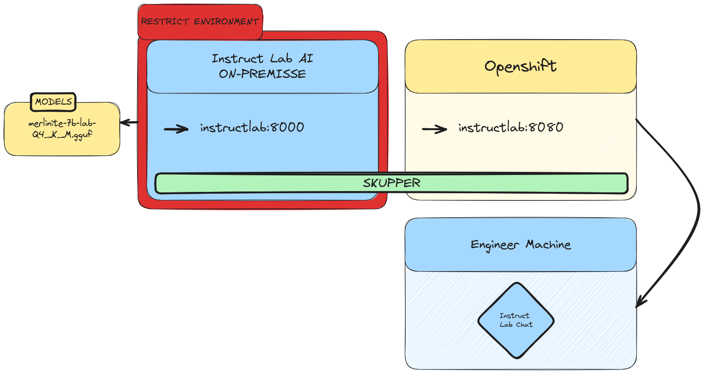

# Welcome to the Ollama Pilot.

## Problem to solve

The main goal of this project is to create a secure connection between two sites, enabling the communication between two models: llama3 and starcode2. The llama3 model will be used for chatbot purposes, while the starcode2 model will be used for code generation purposes. The Ollama Pilot application will be responsible for receiving the user input, sending it to the llama3 model, receiving the response, and sending it to the starcode2 model. The response from the starcode2 model will be sent back to the user. 

> This solution is designed to teams/companies that want to use chatbots and code generators without sharing their data with third parties.

## Disclaimer

All the models used are available in the Hugging Face model hub. The models are not hosted in this project, they are hosted by Hugging Face. The models are used for educational purposes only.

### License

[(https://ollama.com/library/llama3.1/blobs/f1cd752815fc) - llama3 model](https://ollama.com/library/llama3.1/blobs/f1cd752815fc)
[starcode2 model](https://ollama.com/library/starcoder2/blobs/4ec42cd966c9)

This is for educational purposes only. The models are not hosted in this project, they are hosted by Hugging Face. The models are used for educational purposes only, if you are going to use it for commercial purposes, please check other models like [Instruct Labs](https://instruct-ai.com/).

## Description

This project has the objective to create a VAN (Virtual Application Newtwork) that enables the connection between two sites: 
- Site A: A self-hosted application running llama3 with the following models:
  - llama3:8b Meta developed and released the Meta Llama 3 family of large language models (LLMs), a collection of pretrained and instruction tuned generative text models in 8 and 70B sizes. The Llama 3 instruction tuned models are optimized for dialogue use cases and outperform many of the available open source chat models on common industry benchmarks. Further, in developing these models, we took great care to optimize helpfulness and safety. This model will be used for chatbot purposes.
  - starcode2:3b StarCoder2 is the next generation of transparently trained open code LLMs that comes in three sizes: 3B, 7B and 15B parameters. This model will be used for code generation purposes.

- Site B: A Openshift deployment that will host the Ollama Pilot application. This application will be responsible for receiving the user input, sending it to the llama3 model, receiving the response, and sending it to the starcode2 model. The response from the starcode2 model will be sent back to the user.
  - Open Web UI: The user will interact with the application through a web interface.

In order to connect the two sites, we will use Skupper(https://skupper.io/), a tool that enables secure communication between services in different environments. Skupper will be used to create a secure connection between the two sites, allowing the Ollama Pilot application to send requests to the llama3 model and receive the response from the starcode2 model.

At the end of the project you will be able to use your own CHATBOT and CODE GENERATOR without sharing your data with third parties.

## Architecture

